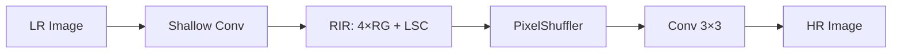

# Elevating Chest X-ray Image Super-Resolution with Residual Network Enhancement

**핵심 주장 및 주요 기여**  
본 논문은 **Residual-in-Residual(RIR) 구조** 기반의 경량 잔차 네트워크를 도입해, 기존 SR 기법 대비 **고주파 정보 학습 집중**, **다중 커널 병렬 잔차 블록**, **조밀 특성 융합(Dense Feature Fusion)**을 통해 흉부 X선 영상의 해상도와 진단 잠재력을 크게 향상시킨다. 기존의 채널 어텐션을 배제하고 복수의 스킵 연결을 활용함으로써 계산 부하를 줄이면서도 SOTA 대비 **PSNR 최대 +0.16 dB**, **SSIM 최대 +0.010**, **MSIM 최대 +0.019** 성능 개선을 달성했다.[1]

***

## 1. 해결하고자 하는 문제  
흉부 X선(CXR) 영상은 폐 질환 진단에 필수적이나, 저해상도 입력으로 인해 미세 병변 검출이 어려운 한계가 있다.  
기존 SR 방법들은  
- GAN 기반의 **과도한 계산량** 및 **훈련/추론 시 배치 정규화(BN) 불일치** 문제[1]
- RCAN의 채널 어텐션(CA) 과다 복잡도  
- 저주파 정보에 치중된 학습  
등으로 실제 의료 적용에 제약이 있다.

***

## 2. 제안 방법  
### 2.1 네트워크 개요  
1) 얕은 특징 추출:  

$$
\mathrm{NSF} = W_{SF} * I_{LR}
$$  

2) 깊은 특징 추출: RIR 구조  

$$
F_{DF} = N_{RIR}(W_{SF} * I_{LR})
$$  

3) 업스케일링: PixelShuffler 후 최종 합성  

$$
I_{HR} = F_{UP}(F_{DF})
$$  

(식 1–3)  

### 2.2 Residual-in-Residual (RIR)  
- **잔차 그룹(RG)** 4개, 각 그룹 당 **병렬 잔차 블록(RB)** 4개  
- RG 내부: RB 출력과 입력을 1×1 컨볼루션으로 조밀 융합  

$$
F_{RG} = \mathrm{Conv}_{1×1}(\mathrm{concat}(F_{RB_1},…,F_{RB_4},F_{in}))
$$  

(식 4)  

### 2.3 병렬 잔차 블록(RB)  
- Inception 구조 차용: 1×1, 3×3, 5×5 병렬 컨볼루션 + LeakyReLU  
- 출력 병합 후 스킵 연결로 고주파 강조  

$$
F_{RB} = F_{in} + \mathrm{Conv}_{1×1}(\mathrm{concat}(T_{1×1},T_{3×3},T_{5×5}))
$$  

(식 5–7)  

### 2.4 손실 함수 및 학습  
- L1 손실 $$\mathcal{L} = \|I_{HR}^{pred} - I_{HR}^{gt}\|_1$$  
- ADAM 옵티마이저, 초기 lr=2×10⁻⁴, 120Epoch마다 ×0.1 감쇠[1]

***

## 3. 모델 구조  

***

## 4. 성능 향상  
- 모든 스케일(X2, X4, X8) 및 데이터셋(CXR1–3)에서 **RCAN 대비 PSNR +0.16–0.23 dB**, **SSIM +0.010–0.018**, **MSIM +0.009–0.019** 우위.[1]
- 노이즈 첨가 실험(SP0.005–0.02)에서도 **PSNR +0.10–1.24 dB**, **SSIM +0.008–0.017** 개선, **강인한 denoising** 능력 입증.[1]
- 채널 어텐션 제거가 오히려 CXR 특성에 적합함을 확인(Abla. Study).[1]

***

## 5. 한계 및 일반화 성능  
- **패치 기반 학습**: 전역 문맥 학습 한계  
- **의료 영상 도메인 편향**: 흉부 X선 외 적용 시 재학습 필요  
- **경량화 vs 성능** 간 균형 조정 여지  

일반화 성능 향상을 위해  
- 다기관·다장비 CXR 데이터로 **도메인 다양성 확보**  
- **Self-supervised Pre-training** 활용하여 소량 라벨로 적응력 강화  
- **융합 어텐션 메커니즘** 재검토로 특징 선택 최적화  

***

## 6. 향후 연구 영향 및 고려사항  
- RIR 기반 경량 SR 모델은 **원격 의료**, **모바일 진단** 환경에서 실시간 SR 서비스 가능성  
- 노이즈·아티팩트 제거 기법 결합 시 **진단 보조 시스템**으로 확대 활용  
- 다양한 의료 모달리티(CT, MRI)로 확장하여 **범용 SR 프레임워크** 개발 기여  

앞으로는 다중 해상도·다중 잡음 조건에서의 **강인성** 평가와 실제 임상 적용을 위한 **실시간 처리 최적화**, **인증 규격 준수** 연구가 중요하다.

[1](https://ppl-ai-file-upload.s3.amazonaws.com/web/direct-files/attachments/22370781/d1841d96-938c-4738-afb1-8a342035082d/jimaging-10-00064.pdf)

# Reference
https://www.mdpi.com/2313-433X/10/3/64
